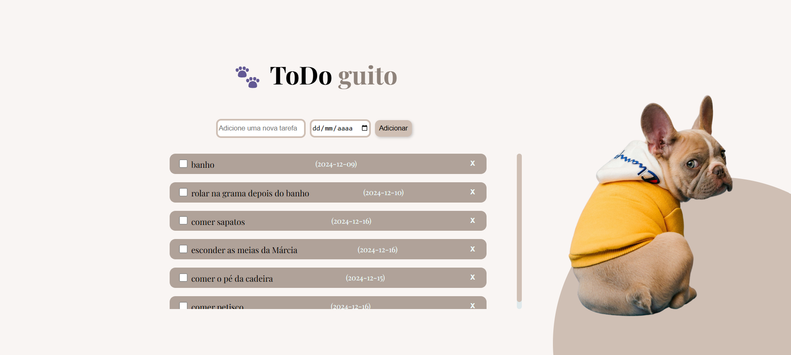
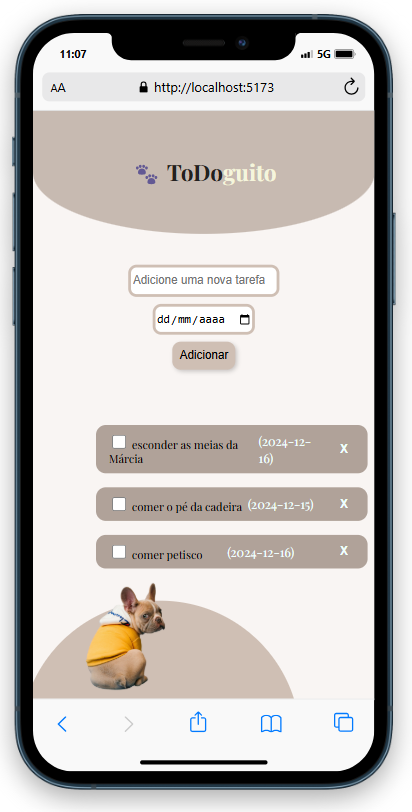

# ToDoguito 📝🐾

Repositório destinado aos estudos da reatividade do moderno framework Javascript para front-end, o Vue! O desafio foi proposto pelo curso *Vai na Web*.
 **O ToDoguito** é uma pequena introdução à esse framework, a intenção foi:
- Criar um To-do List (lista de afazeres) reativa que adiciona, marca, deleta, filtra e reorganiza to-dos (afazeres).

 - Fazer o armazenamento de daod persistentes no navegador do usuário com o uso de localStorage.
 - Criar um design fofo e agradável

## Demonstração 🔍

